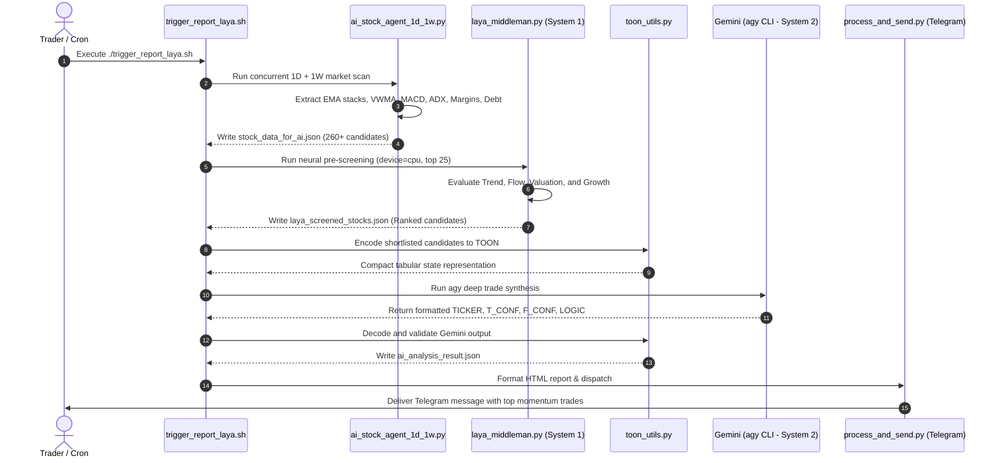

# 🚀 Dual-AI Multi-Timeframe Stock Intelligence Pipeline
### *Autonomous Swing Trading & Market Intelligence System for Indian Equities (NSE)*

---

## 📌 Executive Summary

The **Dual-AI Multi-Timeframe Stock Intelligence Pipeline** is an institutional-grade, automated swing trading decision engine built for the Indian National Stock Exchange (NSE). 

Traditional stock screeners rely either on single-timeframe technical filters (prone to false breakouts) or slow, manual fundamental research. This system solves both challenges by orchestrating a 4-tier pipeline that combines:
1. **Multi-Timeframe Technical Confluence**: Synchronous scanning of Daily (1D) and Weekly (1W) charts across 750+ liquid NSE stocks.
2. **Deep Fundamental Health Screening**: Real-time balance sheet quality, valuation, margin expansion, and institutional ownership metrics.
3. **Laya Neural Middle-Man (System 1)**: A specialized neural classifier powered by modern transformer architectures that pre-screens candidates across 4 core dimensions, eliminating noise before higher-order reasoning.
4. **Gemini Deep Reasoning Engine (System 2 via `agy` CLI)**: High-order LLM reasoning in compressed **TOON** format that synthesizes technical and fundamental confluence into ranked trade setups with precise conviction scoring.
5. **Real-Time Telegram Dispatch**: Sector-clustered alerts delivering high-probability swing trade rationales straight to traders and channels.

---

## 🏗️ System Architecture & Workflow

The architecture is modeled after dual-process cognitive theory (**System 1 Intuitive Pre-Filtering + System 2 Deliberative Reasoning**):

```mermaid
flowchart TD
    subgraph S1["Tier 1: Multi-Timeframe Market Scanner"]
        A["NSE Symbols Cache (755 Equities)"] --> B["Concurrent TradingView Scanner"]
        B -->|1D & 1W Technical Indicators| C["Derived Metrics Engine"]
        D["Yahoo Finance API / Cache"] -->|Fundamentals & Balance Sheets| C
        C -->|260+ Filtered Stocks| E[("stock_data_for_ai.json")]
    end

    subgraph S2["Tier 2: Laya Neural Decision Engine (System 1)"]
        E --> F["Candidate Prioritization (Top 50)"]
        F --> G["4-Dimensional Prompt Structuring"]
        G --> H["Laya Neural Agent (ModernBERT CPU Engine)"]
        H -->|Scores & Classification (top_pick)| I[("laya_screened_stocks.json (Top 25)")]
    end

    subgraph S3["Tier 3: High-Order AI Reasoning (System 2)"]
        I --> J["TOON Compression (70% Token Savings)"]
        J --> K["Gemini Pro / Flash via agy CLI"]
        K --> L["TOON Decoder & Verification"]
        L --> M[("ai_analysis_result.json")]
    end

    subgraph S4["Tier 4: Automated Telegram Delivery"]
        M --> N["process_and_send.py"]
        E -.->|Price & Sector Metadata| N
        I -.->|Laya Scores| N
        N --> O["📱 Telegram Channel Alert"]
    end
```

---

## 🔄 End-to-End Pipeline Workflow



---

## 🔍 Deep-Dive: Core Pipeline Components

### 1. Multi-Timeframe Market Scanner ([`ai_stock_agent_1d_1w.py`](ai_stock_agent_1d_1w.py))
Scans 755 equities across Nifty 500 and high-momentum Microcap segments. 

- **Technical Indicators (1D & 1W)**:
  - **Moving Averages**: EMA20, EMA50, EMA200, SMA200. Evaluates `bullish_ema_stack` (`Price > EMA20 > EMA50 > EMA200`).
  - **Institutional Volume**: Volume Weighted Moving Average (`VWMA`) and percentage distance from VWMA (`vwma_dist_pct`).
  - **Momentum Confluence**: MACD line, Signal line, and calculated MACD Histogram (`macd_hist`) on both 1D and 1W.
  - **Trend Strength & Direction**: ADX, Directional Indicators (`+DI` and `-DI`), evaluating buyer dominance (`+DI > -DI`).
  - **Buyer/Seller Power**: Elder Bull/Bear Power (`BBPower`), Parabolic SAR (`P.SAR`), Ichimoku Base Line.
  - *RSI is intentionally disregarded in trade decision weighting to eliminate range-bound bias during aggressive trend expansions.*
- **Fundamental & Solvency Metrics**:
  - **Valuation**: Trailing P/E, Forward P/E, PEG Ratio, Price-to-Book (`P/B`).
  - **Balance Sheet Health**: Debt-to-Equity ratio, Current Ratio.
  - **Capital Efficiency & Profitability**: Return on Equity (`ROE`), Operating Margin %, Net Margin %.
  - **Growth & Smart Money**: YoY Revenue Growth, YoY EPS Growth, Institutional Holding % (FII/DII), Insider/Promoter Stake %.

---

### 1. Multi-Timeframe Market Scanner ([`ai_stock_agent_1d_1w.py`](ai_stock_agent_1d_1w.py))
Scans 755 equities across Nifty 500 and high-momentum Microcap segments. 

- **Technical Indicators (1D & 1W)**:
  - **Moving Averages**: EMA20, EMA50, EMA200, SMA200. Evaluates `bullish_ema_stack` (`Price > EMA20 > EMA50 > EMA200`).
  - **Institutional Volume**: Volume Weighted Moving Average (`VWMA`) and percentage distance from VWMA (`vwma_dist_pct`).
  - **Momentum Confluence**: MACD line, Signal line, and calculated MACD Histogram (`macd_hist`) on both 1D and 1W.
  - **Trend Strength & Direction**: ADX, Directional Indicators (`+DI` and `-DI`), evaluating buyer dominance (`+DI > -DI`).
  - **Buyer/Seller Power**: Elder Bull/Bear Power (`BBPower`), Parabolic SAR (`P.SAR`), Ichimoku Base Line.
  - *RSI is intentionally disregarded in trade decision weighting to eliminate range-bound bias during aggressive trend expansions.*
- **Fundamental & Solvency Metrics**:
  - **Valuation**: Trailing P/E, Forward P/E, PEG Ratio, Price-to-Book (`P/B`).
  - **Balance Sheet Health**: Debt-to-Equity ratio, Current Ratio.
  - **Capital Efficiency & Profitability**: Return on Equity (`ROE`), Operating Margin %, Net Margin %.
  - **Growth & Smart Money**: YoY Revenue Growth, YoY EPS Growth, Institutional Holding % (FII/DII), Insider/Promoter Stake %.

---

### 2. Laya Neural Decision Engine ([`laya_middleman.py`](laya_middleman.py))
Laya acts as the **System 1 middle-man**, screening out false positives and pre-qualifying candidate stocks before passing them to the LLM.

#### 4-Dimensional Feature Analysis & The Semantic Translation Layer
ModernBERT is a language model pre-trained on text rather than financial arithmetic; raw numbers (e.g. `MACD: -41.98`, `D/E: 213.7`) can trigger lexical overlap bias where the model matches financial terms without understanding numerical signs or comparisons. 

To bridge this, we implemented a dedicated **Semantic Translation Layer** that translates quantitative metrics into high-signal qualitative statements before feeding them to Laya:
- **Trend**: Quantifies EMA stacks, Golden Cross, and VWMA position into qualitative descriptions (*e.g. "Flawless bullish moving average alignment with price leading above all daily and weekly exponential averages"* vs *"Broken technical structure with price trapped below critical 200-day moving average"*).
- **Momentum & Flow**: Translates MACD histogram expansion and +DI/-DI into order flow dynamics (*e.g. "Powerful upward momentum with dual-timeframe expanding MACD histograms"* vs *"Severe negative momentum with dual-timeframe expanding bearish histograms"*).
- **Valuation & Solvency**: Maps Debt-to-Equity and margins into balance sheet health (*e.g. "Pristine fortress balance sheet with virtually zero financial debt"* vs *"Severely overleveraged balance sheet carrying dangerous financial debt risk"*).
- **Growth & Ownership**: Converts YoY growth and institutional stakes into institutional support narratives.

#### Empirical Before vs After Benchmark:
| Metric | Without Semantic Translation | With Semantic Translation Layer |
|---|---|---|
| **Bearish Stock Classification (`POLICYBZR`)** | `choice: "top_pick"` (88.9% prob) ❌ | `choice: "avoid"` (70.0% avoid prob) ✅ |
| **Bullish Setup (`CAPLIPOINT`)** | `choice: "top_pick"` (81.7 score) ✅ | `choice: "top_pick"` (81.8% prob, 78.6 score) ✅ |
| **Candidate Prioritization** | Cluttered with Dual SELL stocks | 100% BUY setups with double confirmation leading |

#### Neural Scoring System
- **Neural Classification**: Prompts Laya with multiple-choice `setup_rating` (`top_pick`, `neutral_mixed`, `avoid`), `is_high_conviction` probability head, and a multi-level `conviction_score` (0–3).
- **Composite Conviction Formula**:
  $$\text{Score} = \text{Base Laya Neural} + \text{Bonus}_{\text{Dual Conf}} + \text{Bonus}_{\text{VWMA}} + \text{Bonus}_{\text{Balance Sheet}} - \text{Penalty}_{\text{Deterioration}}$$
- **Hardware Optimization**: Benchmarked on Apple Silicon; **CPU inference** using ModernBERT-large is **4.4x faster** than MPS (0.77s vs 3.42s per batch of 4 items) due to zero tensor-copy and kernel dispatch overheads.

---

### 3. TOON Data Format & Decoding ([`toon_utils.py`](toon_utils.py))
**TOON (Token-Oriented Object Notation)** converts verbose JSON into dense, tabular notation specifically designed for LLMs.

#### Why TOON?
- **70%+ Token Reduction**: Compresses multi-variable JSON objects into concise comma-separated rows.
- **Header Injection**: Declares schema types once, eliminating key-name repetition across 25 candidates.
- **Deterministic LLM Output**: Forces Gemini to output strict single-line CSV rows without verbose markdown or conversational filler.

#### Sample TOON Input:
```text
stocks[25]{ticker,price,chg,confirmed,sig1d,sig1w,laya_act,laya_score,ema_stack,vwma_dist,macd_hist1d,macd_hist1w,adx1d,adx1w,bbpower,di_bull,pe,fwd_pe,peg,debt,roe,net_margin,op_margin,rev_growth,eps_growth,inst_own}:
  CAPLIPOINT,2867.4,2.6,Y,STRONG_BUY,STRONG_BUY,top_pick,81.7,Y,4.0,9.58,23.2,22.4,32.4,288.6,Y,32.9,25.9,N/A,0.13,N/A,0.291,0.314,0.196,0.159,0.057
  AARTIPHARM,934.25,-0.6,Y,STRONG_BUY,STRONG_BUY,top_pick,78.4,Y,7.7,6.98,22.37,26.2,22.3,150.5,Y,41.4,36.6,N/A,37.36,N/A,0.104,0.192,0.387,0.537,0.125
  CARBORUNIV,1296.5,2.5,Y,STRONG_BUY,STRONG_BUY,top_pick,80.1,Y,8.0,22.96,4.7,26.8,40.4,303.6,Y,117.6,42.9,N/A,10.29,N/A,0.038,0.068,0.194,0.235,0.388
```

---

### 4. Gemini Deep Reasoning & Synthesis (System 2 via `agy` CLI)
Gemini receives the TOON representation and synthesizes cross-domain technical and fundamental signals:
- Checks if the technical expansion is confirmed on both 1D and 1W charts.
- Evaluates whether operating margins and debt levels justify the swing trade entry.
- Outputs integer confidence scores (`T_CONF_INT`, `F_CONF_INT`) alongside dense, actionable trade logic:

```text
CAPLIPOINT, 95, 94, Bullish 1D/1W EMA stack, expanding MACD histogram above VWMA with 31% operating margin and negligible debt.
AARTIPHARM, 93, 91, Dual-timeframe expanding MACD above VWMA with bullish EMA stack, powered by 54% EPS growth and 19% operating margin.
LALPATHLAB, 90, 89, Multi-timeframe ADX trend strength near VWMA with bullish EMA stack, supported by 26% operating margin and minimal debt.
```

---

### 5. Automated Telegram Delivery ([`process_and_send.py`](process_and_send.py))
- Groups shortlisted setups by **Industry Sector**.
- Generates clean, mobile-optimized HTML monospace tables displaying:
  - Rank (`#`), Ticker (`TICKER`), Market Price (`PRICE`), Signal (`SIG`), Technical Score (`T`), Fundamental Score (`F`), and Total Composite (`TOT`).
  - `⚡` indicator denoting dual 1D + 1W confirmation.
- Appends **Top High-Conviction Trades** highlighting Gemini's qualitative trade rationale paired with Laya's neural score.

---

## 📁 Repository & Codebase Map

| File Path | Description | Role in Pipeline |
|---|---|---|
| [`trigger_report_laya.sh`](trigger_report_laya.sh) | Primary execution orchestrator | End-to-end automation driver |
| [`ai_stock_agent_1d_1w.py`](ai_stock_agent_1d_1w.py) | Market scanner & feature builder | Extracts 1D/1W indicators & fundamentals |
| [`laya_middleman.py`](laya_middleman.py) | Laya Neural Decision Agent | System 1 pre-screening & candidate scoring |
| [`toon_utils.py`](toon_utils.py) | TOON encoder & decoder | Optimizes token payloads & parses AI outputs |
| [`process_and_send.py`](process_and_send.py) | Telegram formatting & dispatch | Delivers formatted trade report to channel |
| [`fundamental_cache.json`](fundamental_cache.json) | Local fundamental data cache | Caches Yahoo Finance data to avoid rate limits |
| [`stock_data_for_ai.json`](stock_data_for_ai.json) | Full scanner export | Raw candidate pool for neural evaluation |
| [`laya_screened_stocks.json`](laya_screened_stocks.json) | Laya shortlisted candidates | Top 25 neural-vetted candidates |

---

## ⚡ Quickstart & Execution Guide

### Prerequisites
- Python 3.10+ in virtual environment: `python3 -m venv .venv && source .venv/bin/activate`
- Installed libraries: `pip install -r requirements.txt`
- Antigravity CLI (`agy`) configured with Gemini credentials.
- `.env` file containing `TELEGRAM_BOT_TOKEN` and `TELEGRAM_CHANNEL_ID`.

### Running the Complete Pipeline
To trigger the automated scan, neural screening, AI reasoning, and Telegram notification:

```bash
./trigger_report_laya.sh
```

### CLI Tuning Parameters
Individual modules can be executed standalone with customized options:

```bash
# 1. Run scanner with custom intervals
python ai_stock_agent_1d_1w.py

# 2. Run Laya middle-man with custom pool size, top cutoff, and hardware device
python laya_middleman.py \
    --input stock_data_for_ai.json \
    --output laya_screened_stocks.json \
    --candidates 50 \
    --top 25 \
    --device cpu \
    --batch-size 16

# 3. Test TOON encoding / decoding
cat laya_screened_stocks.json | python toon_utils.py encode
```

---

## 📊 Pipeline Performance & Benchmarks

| Pipeline Stage | Scope | Typical Runtime | Optimization Mechanism |
|---|---|---|---|
| **Market Scan** | 755 NSE Equities | 25 – 35s | ThreadPool concurrency & memory caching |
| **Fundamentals Fetch** | Top 260 Candidates | 5 – 10s | Persistent JSON cache (`fundamental_cache.json`) |
| **Laya Neural Screening** | 50 Pre-filtered Candidates | 80 – 120s | CPU vectorization, ModernBERT-large batching |
| **Gemini Deep Reasoning** | 25 Shortlisted Setups | 30 – 45s | TOON token compression (70% token savings) |
| **Telegram Dispatch** | Final Formatted Report | 1 – 2s | Asynchronous Telegram API |
| **Total End-to-End** | **755 Stocks $\rightarrow$ Top 25 Trades** | **~2.5 – 3.5 mins** | Fully autonomous, zero manual intervention |

---

## 🛡️ Key Architectural Advantages

1. **Elimination of False Breakouts**: Demanding confirmation across both Daily (1D) and Weekly (1W) charts ensures trades align with primary institutional trends.
2. **Double Verification (Laya + Gemini)**: Laya catches structural weakness before expensive LLM processing; Gemini provides nuanced contextual synthesis.
3. **Robust Data Efficiency**: TOON reduces token overhead and strictly prevents common LLM output corruption (like markdown parsing breakages).
4. **Resilient Offline Caching**: Symbol registries and fundamental metrics are locally cached to avoid third-party API rate limits and network latency.
