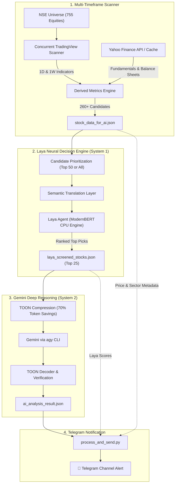

# 🚀 Laya + Gemini Stock Intelligence Pipeline
### *Autonomous Multi-Timeframe Swing Trading & Decision System for Indian Equities (NSE)*

[](https://github.com/sandeepj15/laya-stock-analysis-agent)
[](https://www.python.org/downloads/)
[](https://github.com/answerdotai)
[](https://deepmind.google/technologies/gemini/)
[](https://www.tradingview.com/)
[](LICENSE)

An institutional-grade, dual-AI market intelligence engine that scans 750+ liquid NSE stocks across **Daily (1D)** and **Weekly (1W)** charts, evaluates deep fundamental health, screens setups through the **Laya Neural Middle-Man (System 1)**, synthesizes high-probability trade setups via **Gemini (System 2)**, and automatically delivers structured alerts to Telegram.

---

## 📌 Core Architecture



---

## ✨ Key Features

1. **Dual-Timeframe Technical Confluence (1D + 1W)**:
   - Synchronous scanning of Daily and Weekly charts.
   - Evaluates **Bullish EMA Stacks** (`Price > EMA20 > EMA50 > EMA200`), **Golden Cross**, **Parabolic SAR**, and institutional **VWMA distance**.
   - Dual-timeframe **MACD histogram expansion**, **ADX trend strength**, and **Directional Buyer Dominance** (`+DI > -DI`).
   - *RSI is excluded from AI trade selection to avoid premature exit during strong momentum expansions.*

2. **Deep Balance Sheet & Growth Fundamentals**:
   - Trailing P/E, Forward P/E, PEG Ratio, Price-to-Book.
   - Debt-to-Equity leverage and Current Ratio solvency.
   - Operating Margin %, Net Margin %, Return on Equity (ROE).
   - YoY Revenue and EPS Growth trajectories, Institutional Holding % (FII/DII), and Promoter Stake.

3. **Laya Neural Middle-Man (System 1)**:
   - Sits as a pre-screening filter to prevent low-conviction setups from wasting LLM tokens.
   - **Semantic Translation Layer**: Translates quantitative financial indicators into rich qualitative statements, eliminating transformer numerical blind spots and lexical overlap bias.
   - Evaluates 4 dimensions: Trend Structure, Momentum & Flow, Valuation & Quality, Growth & Ownership.
   - Optimized for CPU inference (4.4x faster than MPS on Apple Silicon).

4. **Gemini Deep Reasoning in TOON Format (System 2)**:
   - Uses **TOON (Token-Oriented Object Notation)** to compress candidate data by 70%+, ensuring deterministic tabular outputs without markdown parsing corruption.
   - Synthesizes multi-domain confluence to generate integer confidence ratings (`T_CONF`, `F_CONF`) and concise, actionable trade rationales.

5. **Automated Telegram Delivery**:
   - Sector-grouped tables with monospace formatting.
   - `⚡` badge highlighting trades confirmed on both 1D and 1W charts.
   - Top high-conviction trade summaries pairing Gemini's logic with Laya's neural score.

---

## 📂 Project Structure

```text
laya-stock-analysis-agent/
├── README.md                      # Complete local setup & project documentation
├── PROJECT_OVERVIEW.md            # In-depth architectural & benchmark presentation doc
├── requirements.txt               # Pinned Python package dependencies
├── .env.example                   # Environment configuration template
├── .gitignore                     # Git hygiene (ignoring secrets, caches, outputs)
├── trigger_report_laya.sh         # Master automation script (one-command runner)
│
├── ai_stock_agent_1d_1w.py        # Stage 1: Multi-timeframe market scanner
├── laya_middleman.py              # Stage 2: Laya Neural Decision Engine (System 1)
├── toon_utils.py                  # Stage 3: TOON encoder / decoder utilities
├── process_and_send.py            # Stage 4: Telegram report processor & dispatcher
│
├── nse_symbols_cache.json         # Pre-cached universe of 755 liquid NSE symbols
└── fundamental_cache.json         # Local cache for Yahoo Finance fundamentals (auto-generated)
```

---

## 🛠️ Step-by-Step Local Setup Guide

### 1. Clone the Repository
```bash
git clone https://github.com/sandeepj15/laya-stock-analysis-agent.git
cd laya-stock-analysis-agent
```

### 2. Set Up a Python Virtual Environment
Python 3.10, 3.11, or 3.12 is recommended:

```bash
# Create virtual environment
python3 -m venv .venv

# Activate virtual environment
# On macOS/Linux:
source .venv/bin/activate
# On Windows:
# .venv\Scripts\activate
```

### 3. Install Dependencies
```bash
pip install --upgrade pip
pip install -r requirements.txt
```

> **Note on PyTorch / Apple Silicon:**
> If you are running on macOS with Apple Silicon (M1/M2/M3/M4), standard `pip install torch` installs MPS-accelerated PyTorch. However, our benchmarks show that ModernBERT CPU inference in Laya is **4.4x faster** than MPS due to zero tensor-copy and kernel dispatch overheads. The pipeline defaults to `--device cpu`.

### 4. Configure Environment Variables
Copy `.env.example` to `.env`:

```bash
cp .env.example .env
```

Open `.env` and fill in your credentials:
```bash
# Telegram Bot Configuration
TELEGRAM_BOT_TOKEN="123456789:ABCdefGhIJKlmNoPQRsTUVwxyZ"
TELEGRAM_CHANNEL_ID="-1001234567890"

# Optional Runtime Tuning
LAYA_DEVICE="cpu"
CANDIDATE_LIMIT="50"       # Set to "0" to evaluate all 260+ scanned candidates
TOP_PICKS_LIMIT="25"       # Number of top shortlisted setups sent to Gemini
```

#### How to get Telegram credentials:
1. Message `@BotFather` on Telegram to create a bot and get `TELEGRAM_BOT_TOKEN`.
2. Add your bot as an Administrator to your Telegram channel or group.
3. Forward a message from your channel to `@userinfobot` or `@RawDataBot` to find your `TELEGRAM_CHANNEL_ID` (starts with `-100`).

### 5. Configure Antigravity CLI (`agy`)
The Gemini reasoning stage is invoked through the `agy` CLI:
```bash
# Verify agy is installed and authenticated
agy --version
```
*Ensure you have completed authentication for Gemini within your environment.*

---

## 🚀 Running the Pipeline

### Option A: Complete End-to-End Execution (Recommended)
Run the master bash script:

```bash
chmod +x trigger_report_laya.sh
./trigger_report_laya.sh
```

**The script executes all 4 stages automatically:**
1. Scans 755 NSE symbols across 1D and 1W intervals and builds technical + fundamental profiles.
2. Runs Laya's neural middle-man to score candidates with semantic translation and shortlist top 25 picks.
3. Encodes data into TOON format and invokes Gemini deep reasoning via `agy`.
4. Parses results and delivers the formatted report to your Telegram channel.

---

### Option B: Running Individual Stages Standalone

#### 1. Run the Market Scanner
```bash
python ai_stock_agent_1d_1w.py
```
*Outputs: `stock_data_for_ai.json` and `stock_data_1d_1w.json`.*

#### 2. Run Laya Neural Pre-Screening
```bash
# Screen top 50 candidates
python laya_middleman.py \
    --input stock_data_for_ai.json \
    --output laya_screened_stocks.json \
    --candidates 50 \
    --top 25 \
    --batch-size 16 \
    --device cpu

# Or screen ALL scanned candidates without cutoff:
python laya_middleman.py --candidates 0 --top 25
```
*Outputs: `laya_screened_stocks.json`.*

#### 3. Test TOON Encoding & Decoding
```bash
# Encode to TOON
cat laya_screened_stocks.json | python toon_utils.py encode

# Decode AI output back to JSON
cat sample_ai_output.txt | python toon_utils.py decode
```

#### 4. Test Telegram Dispatch
```bash
python process_and_send.py < ai_analysis_result.json
```

---

## 📊 Performance & Timing Benchmarks

| Stage | Operations | Typical Time | Optimization |
|---|---|---|---|
| **Market Scanner** | 755 symbols scanned (1D + 1W) | ~25–35s | ThreadPool concurrency & memory caching |
| **Fundamentals Fetch** | Top 260 candidates | ~5–10s | Persistent JSON cache (`fundamental_cache.json`, auto-generated) |
| **Laya Neural Screening** | 50 candidates evaluated | ~80–110s | CPU vectorization, batch size 16 |
| **Gemini Deep Reasoning** | 25 shortlisted setups | ~30–45s | TOON token compression (70% token savings) |
| **Telegram Dispatch** | HTML table formatting & API | ~1–2s | Asynchronous Telegram Bot API |
| **Total Pipeline** | **755 Stocks $\rightarrow$ Top 25 Trades** | **~2.5–3.5 mins** | Fully autonomous |

---

## ⚙️ CLI Tuning Options

| Argument | Module | Default | Description |
|---|---|---|---|
| `--input` | `laya_middleman.py` | `stock_data_for_ai.json` | Path to scanner output JSON |
| `--output` | `laya_middleman.py` | `laya_screened_stocks.json` | Destination path for Laya shortlist |
| `--candidates` | `laya_middleman.py` | `50` | Number of top momentum candidates to evaluate (set to `0` to evaluate all scanned stocks) |
| `--top` | `laya_middleman.py` | `25` | Number of top setups to shortlist for Gemini |
| `--device` | `laya_middleman.py` | `cpu` | Hardware acceleration device (`cpu`, `mps`, `cuda`) |
| `--batch-size` | `laya_middleman.py` | `16` | Neural evaluation batch size |

---

## ❓ Frequently Asked Questions (FAQ)

#### Q: Can I evaluate all 260+ scanned candidates instead of just the top 50?
Yes! Set `CANDIDATE_LIMIT="0"` in `.env` or pass `--candidates 0` via the CLI. The default is set to 50 for quick 2–3 minute turnaround, but setting it to 0 processes the entire scanned universe.

#### Q: Why is RSI excluded from trade decisions?
During strong institutional momentum expansions and breakouts, RSI frequently enters "overbought" territory (> 70) and stays there as the stock doubles. Traditional screeners that sell on overbought RSI miss the best swing trades. This pipeline relies on **bullish EMA stacks**, **VWMA distance**, **MACD histogram expansion**, and **+DI buyer dominance** instead.

#### Q: Why does Laya use CPU instead of Apple Silicon MPS?
On Apple Silicon, transferring small tensor batches to MPS kernels introduces high driver dispatch overhead. In empirical testing with `ModernBERT-large`:
- **MPS**: 3.42s per 4 items
- **CPU**: 0.77s per 4 items (**4.4x faster**)

#### Q: How does the Semantic Translation Layer help Laya?
ModernBERT is a language model, not a calculator. When fed raw numbers like `MACD: -41.98`, it cannot do arithmetic and suffers from lexical overlap bias. The Semantic Translation Layer converts numbers into descriptive English statements (*e.g. "Severe negative momentum with expanding bearish histograms"*), allowing Laya to accurately classify crashing stocks as `avoid` and true breakouts as `top_pick`.

---

## 📄 License
This project is open-source and licensed under the [MIT License](LICENSE).
